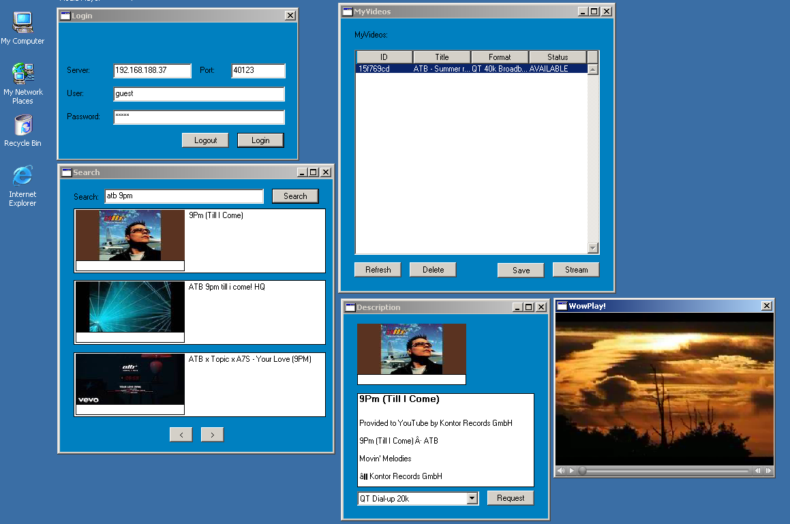

# WowTube

WowTube is a video download and streaming server designed for LAN environments. It allows clients to search for YouTube videos, request downloads, and stream the converted videos via FTP.

https://youtu.be/3-8mGFq9UhE 

## Downloads 
https://github.com/privatebjorn/wowtube/releases/tag/V1.0.0 

## Features

- YouTube video search and download
- Automatic video conversion to compatible formats
- FTP server for video streaming
- User authentication and quotas
- Threaded worker pool for processing jobs

## Architecture

The server consists of several components:

- **Main Server**: TCP server handling client commands
- **FTP Server**: Serves converted videos to clients
- **Worker Pool**: Processes download and conversion jobs
- **Database**: Stores user data and job status in CSV files

## Protocol

WowTube uses a simple line-based TCP protocol. Commands are sent as uppercase strings, responses are returned as strings.

### Commands

- `LOGIN <username> <password>`: Authenticate user
- `SEARCH <query>`: Search YouTube for videos
- `DETAIL <video_id>`: Get video details
- `REQUEST <video_id> <format>`: Request video download
- `MYVIDEOS`: List user's videos
- `JOBSTATUS <job_id>`: Check job status
- `DELETE <video_id>`: Delete a video
- `STREAMURL <video_id>`: Get FTP URL for streaming

### Status Codes

- `QUEUED`: Job is waiting in the worker pool
- `DOWNLOADING`: Video is being fetched from YouTube
- `CONVERTING`: Video is being converted
- `AVAILABLE`: Video is ready for streaming
- `ERROR`: Something went wrong

## Installation

1. Install dependencies: `pip install -r requirements.txt`
2. Configure `settings.ini` and `users.ini`
3. Run the server: `python -m server`

## Configuration

- `settings.ini`: Server settings (ports, formats, etc.)
- `users.ini`: User accounts and quotas